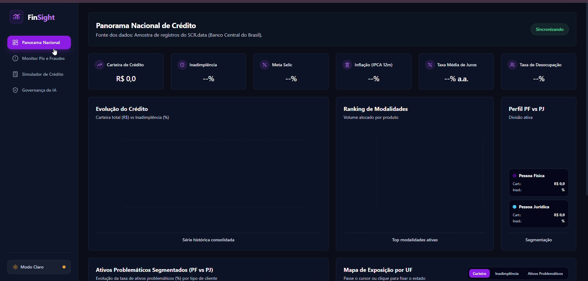
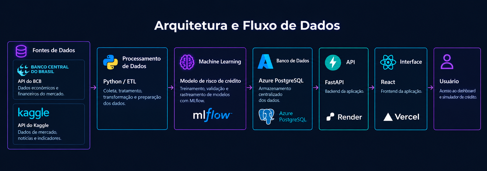

# *FinSight — Plataforma de Inteligência Financeira & Governança de IA*

  

  
  
  
  
  
  
  
  
  
  
  

---

## Aplicação

  

---

## Sobre

O **FinSight** é uma aplicação web full-stack de alta performance desenvolvida para o setor financeiro e de crédito. O objetivo principal da plataforma é unificar em um único ecossistema análises macroeconômicas oficiais, monitoramento de transações instantâneas contra fraudes no ecossistema Pix, simulação preditiva de concessão de crédito baseada em Machine Learning e governança algorítmica ponta a ponta com rastreabilidade em nuvem.

---

## Fontes de Dados Utilizadas

O FinSight baseia-se em conjuntos de dados reais e representativos do mercado financeiro brasileiro e internacional:

1. **Panorama Nacional de Crédito:**
   * **Fonte:** Amostra representativa de **29.924 registros** extraídos do **SCR.data (Sistema de Informações de Crédito do Banco Central do Brasil - BCB)**.
   * **Indicadores:** Evolução da Carteira de Crédito Total, Taxa de Inadimplência, Meta Selic, IPCA (Inflação 12m), Taxa Média de Juros e Taxa de Desocupação.

2. **Simulador de Risco de Crédito:**
   * **Fonte:** Dataset ***Financial Risk for Loan Approval*** (proveniente do Kaggle).
   * **Variáveis:** Histórico de renda, montante do empréstimo, pontuação de crédito, histórico de inadimplência prévia e variáveis demográficas para predição de risco de default.
   * *Nota de escolha:* O dataset foi selecionado por permitir simulações baseadas em variáveis acessíveis ao cliente final, mantendo a simplicidade da experiência de uso sem a necessidade de dados confidenciais ou de difícil obtenção.

---

## Arquitetura de Dados & Nuvem

O projeto adota uma arquitetura em nuvem moderna, desacoplada e altamente escalável:

  

